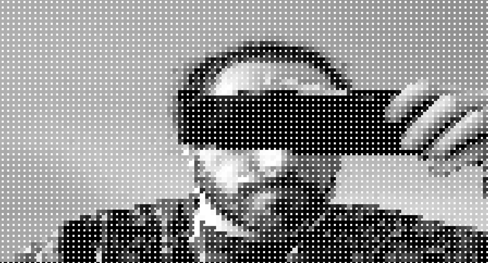

# P5.js Webcam Sketch
This is a sketch to access your webcam and create a custom "filter" for it. Google is watching you! 🛰

It's based on a tutorial by the great Daniel Shiffman which you can find here:

[11.1: Live Video and createCapture() - p5.js Tutorial](https://www.youtube.com/watch?v=bkGf4fEHKak&list=PLRqwX-V7Uu6aKKsDHZdDvN6oCJ2hRY_Ig)
