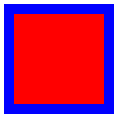
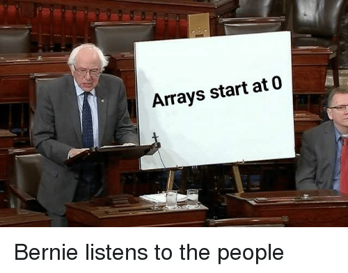

# P5.js-for-beginners
This is the repository for the P5.js beginners workshop at the processing Community Day 2019 in Basel. 

## Setup

Let's first download a code editor of your choice and install a live server plugin. This plugin simulates a web server so you have the same working conditions like having your project on a "real" website. We can recommend you to editors:

##### Visual Studio Code:

1. [Install Visual Studio Code](https://code.visualstudio.com/)
2. Go to Plugins and search for Live Server by Ritwick Dey -> Install
3. Open current project folder in Visual Studio Code
4. In the bottom right corner click -> Go Live
5. A browser window will open showing the project.

##### Atom:

1. [Install Atom](https://atom.io/)
2. Install atom-live-server from Preferences -> Install -> Install Packages
3. Open current project folder in Atom
4. From Menu Bar open Packages -> atom-live-server -> run ....
5. A browser window will open showing the project.


## Folder Structure

We provide you with starting templates to download (on the top of the page). They will have the following folder structure:

```
00_empty_template //folder top open in editor, can be renamed
│   index.html //the file shown by the browser
│   sketch.js //this is where your p5.js code will go!
│
└─── assets //the files required by the website
     │  
     │
     └─── css
     │   └─── style.css  //stylesheet for this website
     │
     └─── p5js //p5js library

```

## P5.js

Let's look at the basics of your P5.js sketch. This is the file `sketch.js` inside your project folder.

### 1. Basic functions:

Every P5.js sketch needs the following two functions.
This one will execute once at the beginning. You create your canvas here and need to tell it how big it is:

```
function setup() {
  createCanvas(720, 400);
}
```

This one executes 60 times a second (loop). This loop makes it possible, that your drawing is changing.

```
function draw() {
  rect(10, 20, 50, 50);
}
```
### 2. Coordinate system and units of measure:

In P5.js you work with a `x` and `y` axis. `x` is horizontal or the "width", `y` is vertical or the "height" of an object. Usually you work with numbers which equal to pixel (e.g. `100` is 100px on your screen). You can also use `%` instead of pixel. For working with retina displays it's usefull to add `pixelDensity(1);` to the setup. 

```
createCanvas(720, 400); //canvas is 720 x 400 px
pixelDensity(1); //takes care of hi-res retina displays
```

```
rect(10, 20, 50, 50); //rectangle is positioned at x: 10, y: 20 and 50 x 50 px
```

### 3. Primitiv shapes
There are different shapes predefined. Including rectangles, circles, triangles and more. [For a full reference visit the p5.js website](https://p5js.org/examples/form-shape-primitives.html). Depending on there shape they need different arguments:

```
rect(x, y, width, height);
ellipse(x, y, width, height);
line(x1, y1, x2, y2)
triangle(x1, y1, x2, y2, x3, y3)
```

You can give color and stroke. If you don't want a stroke write: `noStroke();`

```
fill(255, 0, 0);
stroke(0, 0, 255);
strokeWeight(5);
rect(10, 20, 50, 50);
```
The code above results in: 



### 4. Color

P5.js uses the RGB color mode by default. Every color needs therefore 3 arguments: `fill(red, green, blue)`. The values range from 0 to 255. If you only write one argument it will result in grayscale. 

```
fill(0) // black
fill(255) // white
``` 

You can also use different color modes like HEX, HSB or HSL or RGBA (transparency). [For a full reference visit the p5.js website](https://p5js.org/reference/#/p5/color).

### 5. Variables

To be more flexible you can use variables. They are key elements of Javascript.

```
var myVariableName; // declare a variable
var size = 100; // declare a variable and assign a value
```
Now you can use this variable (and it's value) in the code: `rect(0, 0, size, size);` Awesome! 🎉

Variables have a scope. This means, that where you declare the variable also defines where in the code you can use them.

```
var size = 100; // at the top of the file makes it useable everywhere (global)

function setup() {
  var secondSize = 200; // variable INSIDE a function
  ellipse(0, 0, secondSize, secondSize); // useable ONLY INSIDE the function
}

function draw() {
  rect(0, 0, size, size); // you can use the global variable here
  ellipse(0, 0, secondSize, secondSize); // not useable OUTSIDE the function
}

```

There are also built in variable like `mouseX`, `mouseY` as well as canvas `width` and `height`. 

### 6. Datatypes

There are a few datatype to know about. 🚨 **Usually we use all of them in combinations with variables!**

```
var a = 100 // mostly numbers
var b = "I am a setence" // string data type: words
var c = color('#0f0'); // the way to use other colors
var d = [10, 20, 30, 40]; // array data type: a list of things.

// to look into the list (array)
d[0] // gives you 10
d[1] // gives you 20

```



Yeah, the array is a weird thing! 🔮 Why does it start at 0? Nobody knows, just remember it. Arrays are super usefull! Also practically every data out in the web (e.g. your facebook likes) is safed as array data type.

### 7. Console

Every browser has a console. You can output data in the console to see problems in the code by writting `console.log(myVariable)`. If you log an array it will show you the full list. The console is **super helpfull**, never underestimate the power of the console 💪.

### 8. For loop

If you want to handle many similar things at once, the "for loop" is the weapon of choice. `var i` is a counter which usually starts at `0`. As long as `i` is smaller than `100` the code inside the `{}` gets executed. `i = i + 1` indicates how big the counting steps are.

```
for (var i = 0; i < 100; i = i + 1) {
  rect(0, 0, 100, 100);
}
```
This code draws 100 rectangles on the same position. Cool, right? Keep reading!

### 9. Random

Usually you need a bit of random to make you code spicy 🔥 at some point. This outputs you a random number between 0 and 100: `random(0, 100);`. Trough this the code from above makes much more sense:

```
for (var i = 0; i < 100; i = i + 1) {
  var x = random(0, width);
  var y = random(0, height);
  rect(x, y, 100, 100);
}
```


## Outlook
We can encourage you to check out the following resources:

[Daniel Shiffman - creative coding guru](https://shiffman.net/)

[Learn more from the P5.js website!](https://p5js.org/learn/)

[Official P5.js Forum](https://discourse.processing.org/c/p5js)

[ml5.js - Friendly Machine Learning for the Web.](https://ml5js.org/)

[P5.js subreddit](https://www.reddit.com/r/p5js/)
